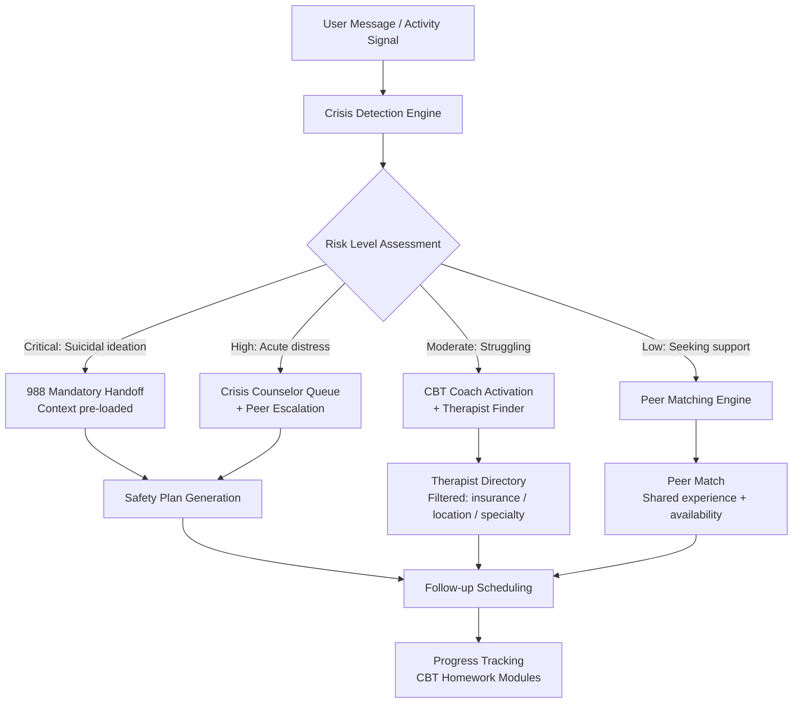

<p align="center">
  <h1 align="center">MAMA Mental Health</h1>
  <h3 align="center"><em>AI crisis detection with mandatory 988 handoff.<br>Because a person in crisis deserves more than a hotline number.</em></h3>
</p>

<p align="center">
  <a href="LICENSE"></a>
  
  
  
  
  <a href="https://mama.oliwoods.ai"></a>
  <a href="https://mama.oliwoods.ai/foundation"></a>
</p>

---

> **1 in 5 American adults — 57.8 million people — experience a mental illness each year. Only 46.2% receive any treatment. When someone finally reaches out for help, the average wait time to see a psychiatrist is 25 days.** This library is the AI layer that catches people in that gap: detecting crisis language before it becomes a crisis, routing to 988 with context already loaded, matching to peer support within minutes, and delivering evidence-based CBT techniques at 3am when every office is closed. **We're not replacing therapists. We're making sure no one falls through the crack between needing help and getting it.**

---

## Why This Exists

- **The treatment gap is catastrophic.** 57.8M Americans live with mental illness; 30M receive no care (SAMHSA, 2022). Cost, stigma, and provider shortages are the three barriers — this library attacks all three.
- **Crisis response is broken.** Before 988 launched in 2020, 41% of crisis calls to 911 resulted in police response, not mental health intervention. 988 exists now — but most digital products don't route to it, and none pass context when they do.
- **CBT works — but most people can't access it.** Cognitive Behavioral Therapy has decades of evidence behind it (Butler et al., 2006) but requires a licensed therapist, $150-300/session, and a 3-week average wait. We've encoded the core CBT techniques as algorithms, not paywalled content.
- **Peer support is as effective as professional counseling for many presentations.** Meta-analyses confirm peer support reduces hospitalization rates by up to 28% (Lloyd-Evans et al., 2014). We built the matching engine to make it scalable.

---

## How It Works



---

## Why This Exists: The Data

- **988 Suicide & Crisis Lifeline** received 5.7M contacts in 2023 — a 23% increase from 2022. Demand is growing faster than capacity.
- **Average wait for mental health appointment: 25 days** (NAMI, 2023). This library closes the gap with real-time AI triage and peer matching.
- **Shortage of providers:** The U.S. needs 31,109 more mental health practitioners to meet current demand (HRSA, 2023).
- **Peer support ROI:** Every $1 invested in peer support programs saves $8 in emergency services (Trachtenberg et al., 2020).

---

## Features & Modules

| Module | What It Does |
|--------|-------------|
| **crisis-detection** | NLP-based risk scoring across 7 crisis dimensions. Keyword + context + behavioral pattern analysis. Flags passive ideation, active ideation, and plan disclosure separately |
| **988-handoff** | Mandatory 988 routing for critical-risk signals. Pre-populates context (risk level, triggers, safety plan) so the counselor has information before the call connects |
| **cbt-coach** | Evidence-based CBT techniques: thought records, cognitive restructuring, behavioral activation, exposure hierarchies, distress tolerance. Structured as stateful sessions |
| **peer-matching** | Matches users by lived experience, availability, and communication preference. Age-gap rules, shared diagnosis categories, and moderation layer |
| **therapist-finder** | Provider directory with insurance filtering, location-based search (haversine), specialty matching, and waitlist notification |
| **safety-plan** | Stanley-Brown Safety Planning Intervention encoded as a guided workflow. Personalized warning signs, coping strategies, and social supports |
| **mood-tracker** | Longitudinal mood logging with PHQ-9 / GAD-7 screening tools. Trend detection triggers proactive outreach |
| **crisis-resources** | Location-aware resource database: shelters, warmlines, mobile crisis units, walk-in clinics |
| **progress-tracking** | CBT homework completion, mood trend analysis, peer engagement metrics, therapist appointment adherence |

---

## How It Works — Technical

This is a **TypeScript algorithm library** — no server, no database, no UI. Pure functions with Zod schemas designed to be integrated into any mental health application.

```typescript
import {
  assessCrisisRisk,        // 7-dimension risk scoring
  triggerHandoff988,       // Mandatory 988 routing with context
  matchPeerSupport,        // Availability + experience matching
  runCBTSession,           // Structured CBT technique delivery
  generateSafetyPlan,      // Stanley-Brown protocol implementation
  screenWithPHQ9,          // PHQ-9 depression screening
} from "mama-mental-health";
```

**Architecture pattern across all modules:**
```
Zod Schemas (types) → Constants (clinical defaults) → Pure Functions (algorithms)
```

- No OOP classes — pure functions only. No side effects, no global state.
- All types derived from Zod schemas with `z.infer`
- Crisis detection runs client-side — no data leaves the device for risk assessment
- 988 handoff is the only mandatory network call — by design

---

## Research Backing

> Butler, A. C., Chapman, J. E., Forman, E. M., & Beck, A. T. (2006). "The empirical status of cognitive-behavioral therapy: A review of meta-analyses." *Clinical Psychology Review, 26*(1), 17–31. — CBT is effective for 16 of 16 reviewed conditions including depression, anxiety, PTSD, and suicidal ideation.

> Lloyd-Evans, B., Mayo-Wilson, E., Harrison, B., et al. (2014). "A systematic review and meta-analysis of randomised controlled trials of peer support for people with severe mental illness." *BMC Psychiatry, 14*(1). — Peer support reduces psychiatric hospitalization by 28% and improves quality of life across presentations.

> Stanley, B., & Brown, G. K. (2012). "Safety Planning Intervention: A Brief Intervention to Mitigate Suicide Risk." *Cognitive and Behavioral Practice, 19*(2). — The Stanley-Brown Safety Planning protocol reduces suicidal behavior by 45% in 6-month follow-up.

> SAMHSA (2023). *National Survey on Drug Use and Health.* — 57.8M adults with AMI; 30M with untreated SMI. Mental health spending exceeds $280B/year with outcomes declining.

---

## Quick Start

```bash
git clone https://github.com/OliWoods-Org/mama-mental-health.git
cd mama-mental-health
npm install
npm run build
npm test
```

## Tech Stack

- **Runtime:** Node.js + TypeScript
- **Validation:** Zod schemas
- **Database:** Supabase (PostgreSQL) — optional; crisis detection runs offline
- **AI:** Claude API / local LLM (offline mode)
- **Crisis Routing:** 988 Lifeline API integration
- **Alerts:** Twilio (SMS/WhatsApp), Resend (email)

---

## Related Projects

| Project | Description |
|---------|-------------|
| [mama-ai-clinic](https://github.com/OliWoods-Org/mama-ai-clinic) | $170 Raspberry Pi offline AI device — runs this library in offline/rural settings |
| [mama-montessori](https://github.com/OliWoods-Org/mama-montessori) | AI-powered Montessori education for every child |
| [mama-elder-care](https://github.com/OliWoods-Org/mama-elder-care) | HIPAA-compliant care coordination for older adults |
| [mama-addiction-recovery](https://github.com/OliWoods-Org/mama-addiction-recovery) | Addiction recovery support and resource matching |
| [foundation-rare-dx](https://github.com/OliWoods-Org/foundation-rare-dx) | Rare disease diagnosis accelerator |

---

## Contributing

Mental health is too important to be built by one team. We need:

- **Clinical validators** — Licensed therapists to review CBT module accuracy
- **Crisis counselors** — Input on 988 handoff UX and context delivery
- **Lived experience reviewers** — People who've navigated the mental health system
- **Translators** — 15+ language support; glossary needs clinical terms

See [CONTRIBUTING.md](CONTRIBUTING.md) for guidelines.

---

## License

AGPL-3.0. Free forever. An [OliWoods Foundation](https://github.com/OliWoods-Org) project.

> *"The most important thing is that we treat mental illness like any other illness — with urgency, with investment, and without stigma."*

---

<p align="center">
  <strong>Built by the <a href="https://oliwoods.ai">OliWoods Foundation</a></strong><br>
  <em>Free forever. Open source. Because a mental health crisis at 3am deserves more than a busy signal.</em>
</p>
